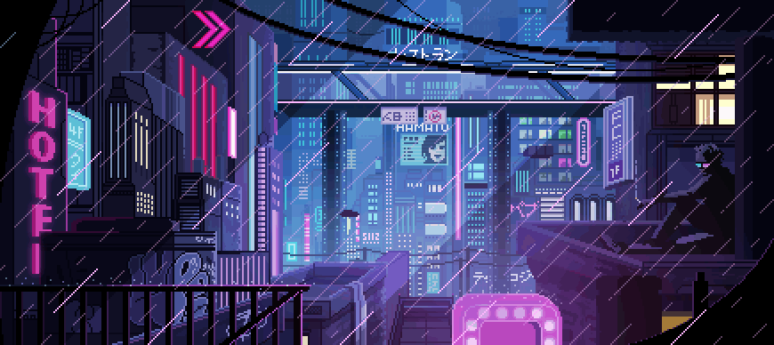

<html>

    

</html>

# My way to the iOS-engineer.
- 🧑‍💻 Bmstu student, [IU5](https://github.com/DimaPermyakov/IU5)-[IT](https://github.com/IU5-IT)
- 🤵 19 y.o. (14.03.2003). 
- 🎓 The second-year student.
- 💻 Apple Chip M2.
- ☕️ Coffee.

---

## My favorite repositories:
* [Tinkoff](https://github.com/mightyK1ngRichard/TinkoffNews)    
* [iOS-Application](https://github.com/mightyK1ngRichard/CruelApplication)
* [I know you](https://github.com/IU5-BOT/GroupGame)

## Anymore:

  
  Click to expand 

## Stats:

    
     

    
### Operating system:

### Languges and Tools: 
 

### Connect with me in social networks:

 

