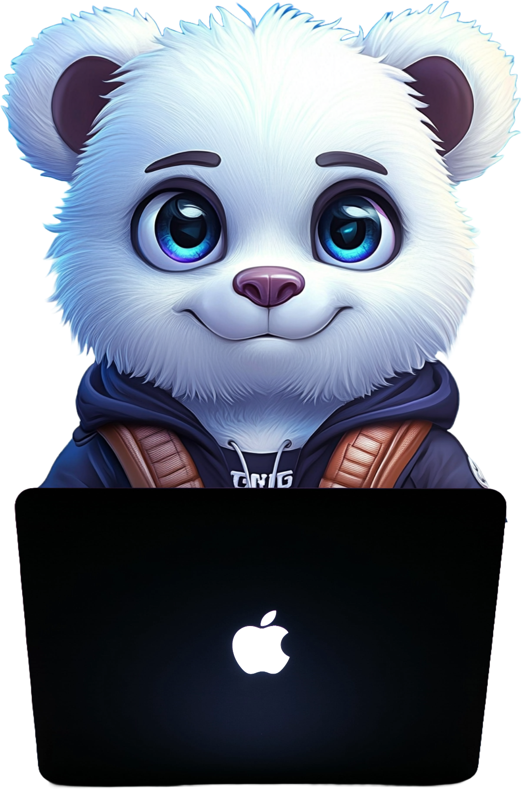

### **Lead iOS Developer**
_Moscow, Russia_

Links:

* E-mail: dimapermyakov55@gmail.com
* GitHub: https://github.com/mightyK1ngRichard
* Telegram: https://t.me/mightyK1ngRichard
* VK: https://vk.com/mightyk1ngrichard

  
 Open resume 

  
### **About**
3 years of software development. BMSTU IU5, Bachelor's graduate (2025), currently pursuing Master's degree.

- Have backend development experience (Golang/Python/Swift), which helps me to understand overall product architecture and communicate with backend team
- Love good architecture and clear naming of things
- Can propose new features/solutions for business, estimate and write docs for them
- Lead a team of developers (gathering information, preparing tasks, code review)
- Currently exploring **Machine Learning / AI**: PyTorch, CNNs, LLM integration, on‑device ML with CoreML

### **Tech Stack**
- **iOS**: 
  - SwiftUI, UIKit
  - Vapor, CreateML/CoreML, ARKit, AVFoundation 
  - SwiftData, Realm, SQLite
  - GCD, Swift Concurrency
  - Resolver, Needle, SwiftInject
  - Tuist, SPM, Targets
  - MVVM-C, VIPER, MVC, MVP, CleanSwift, Flux
- **Machine Learning / AI**:
  - PyTorch, TensorFlow, CoreML, CreateML
  - CNN, Transformers, RNN/LSTM
  - YOLO, ONNX, Vision (Apple)
- **Programming languages**: Swift, Golang, Java, Kotlin, Python, C/C++, JavaScript, TypeScript, Assembler
- **Backend**: Golang, Swift+Vapor, Java Spring, Kotlin Ktor, Python Django/Flask, NodeJS
- **Frontend**: React, JavaScript, TypeScript, CSS/HTML5, Redux Toolkit
- **DevOps**: Ubuntu/Alt Server, Docker, Nginx, CI/CD, K8s, grafana
- **Database**: Postgresql, Firebase, Mongodb, Redis, Amazon S3, Kafka
- **Client Server Interaction**: HTTP/1.1, WebSocket, gRPC HTTP/2.0
- **API Architectural style**: Rest, gRPC

### **Employment history**
| Period | Description |
| - | - |
| April 2026 — Now | Chief Development Engineer at Sberbank |
| July 2023 — March 2026 | Middle+ iOS Developer at Wildberries, B2B Bank |

### **Education**
| Period | Description |
| - | - |
| 2025 - 2027 | Master's Degree, Bauman Moscow State University, IU5 |
| 2021 - 2025 | Bachelor's Degree, Bauman Moscow State University, IU5 |
| 2023 - 2024 | Technopark VK x BMSTU |
| 2022 - 2023 | Digital Academy x BMSTU |

### **Work examples (apps)**

* #### **Торт&Land**
  _FullStack Application | Final qualifying work | BMSTU IU5 2025_
  
    _Stack_: 
    - Languages: Swift, GoLang, Kotlin
    - Backend Microsevices: Kotlin, GoLang, Swift + Vapor.
      - Auth: JWT Refresh Tokens + Black list
      - Database: PostgresSQL, Firebase, Amazon S3
      - Client-server API Architectural style: gRPC
    - IOS features: SwiftUI, MapKit, SwiftData, LocalPushNotification, WebSocket, Async/await, ARKit, Video Streaming M3U8D
    
    [ Look more [IOS+MacOS]](https://github.com/mightyK1ngRichard/bmstu-2025-final-qualifying-work)

    [ Look more [Go Backend]](https://github.com/mightyK1ngRichard/bmstu-2025-final-qualifying-work-backend-go)
 

* #### **CakesHub**
  _iOS application | Diploma Project | VK Edu x BMSTU_
  
    _Stack_: SwiftUI, Firebase, SwiftData, MapKit, LocalPushNotification, WebSocket, Vapor, Async/await
    
    [ Look more](https://github.com/mightyK1ngRichard/VK-iOS-Marketplace)
 

* #### **MissionControlCenterInterfaceIOS**

  _iOS application | Hackathon x BMSTU_
  
  _Stack_: SwiftUI, C#, RestAPI, Docker, S3, Postgresql

  [ Look more](https://github.com/mightyK1ngRichard/MissionControlCenterInterfaceIOS)
 

* #### **RealTimeMessenger**

  _iOS application | Course work, Network technologies x BMSTU_
  
  _Stack_: SwiftUI, Vapor, WebSocket+HTTP

  [ Look more](https://github.com/mightyK1ngRichard/RealTimeMessenger-iOS)
 

* #### **DevelopmentNetworkApplicationBackend**

  _FullStack Application Go+React+SwiftUI | Laboratory work x BMSTU_
  
  _Stack_: SwiftUI, Golang, Docker, Nginx, S3, Redis, Postgresql, RestAPI, Gin, Gorm, Swagger, React, Redux Toolkit

  [ Look more](https://github.com/mightyK1ngRichard/DevelopmentNetworkApplicationBackend)
 

* #### **SmokingDetectionApplication**

  _iOS Video streaming Application | Homework x BMSTU_
  
  _Stack_: UIKit, AVFoundation, CreateML, CoreML, Vision

  [ Look more](https://github.com/mightyK1ngRichard/SmokingDetectionApplication/tree/main)
 

* #### **WoodGrowthCourseWorkSwiftUI**

  _Macos application | Database coursework x BMSTU_
  
  _Stack_: SwiftUI, NodeJS, Docker, Postgresql

  [ Look more](https://github.com/mightyK1ngRichard/WoodGrowthCourseWorkSwiftUI)
 

